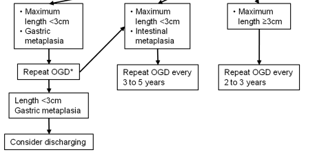

# Barrett's Oesophagus

  

## **Specific diseases - Barrett’s oesophagus**

  

One particular disease that lends itself well to analytics, particularly
as it is part of a surveillance programme, is the premalignant
oesophageal condition Barrett’s oesophagus. This is characterised by the
growth of cells (called columnar lined epithelium) in the oesophagus.
These cells usually occupy the lower part of the oesophagus as a
continuous sheet from the top of the stomach to varying lengths up the
oesophagus.

This condition requires endoscopic surveillance and the timing of this
depends on the prior endoscopic features (namely the length of the
Barretts segment as measured by the Prague score- explained below) and
the pathological stage at that endoscopy (which for non-dysplastic
samples, since the revised 2013 UK guidelines, means the presence or
absence of intestinal metaplasia). This can be seen in the image below
(from Fitzgerald RC, et al. Gut 2013;0:1–36.
<doi:10.1136/gutjnl-2013-305372>)

  



  

## **1. Pre-processing Barrett’s samples**

  

Such a dataset needs some processing prior to the analysis so for this
we can turn to a specific set of function for Barrett’s oesophagus
itself.

  

### **a) Prague score**

  

Firstly we need to extract the length of the Barrett’s segment. This is
known as the [Prague
score](https://services.nhslothian.scot/endoscopyunit/InformationForClinicalStaff/Documents/PRAGUE%20CRITERIA.pdf)
and is made up of the length from the top of the gastric folds (just
below the gastro-oesophageal junction) to the top of the circumferential
extent of the Barrett’s segment (C). In addition the maximal extent is
from the top of the gastric folds to the top of the tongues of Barrett’s
segment (M). This gives an overall score such as C1M2.

  

After filtering for endoscopic indication (eg “Surveillance-Barrett’s”-
this is stored in the ‘Indication’ column in our data set) the aim of
the following function is to extract a C and M stage (Prague score) for
Barrett’s samples. This is done using a regular expression where C and M
stages are explicitly mentioned in the free text. Specifically it
extracts the Prague score. This is usually mentoned in the ‘Findings’
column in our dataset but obviously the user can define which column
should be searched.

``` r

v<-Barretts_PragueScore(Myendo,'Findings','OGDReportWhole')
```

|   | ProcedurePerformed | Findings | CStage | mytext | MStage |
|:--:|:--:|:--:|:--:|:--:|:--:|
| **23** | Gastroscopy (OGD) | STOMACH: diffuse gastritis with angiodysplasia and punctate bleeding site on greater curve mid body - no obvious ulcer- antrum scar ?,OESOPHAGUS: Barrett’s osophagus C3M5 34-39cm ,He also has erosive gastritis in the fundus ,STOMACH: non-erosive gastritis from mid-body to antrum, CLO test: negative ,STOMACH: numerous fundic glands looking polyps at body and fundus with size ranging from 2 mm to 10 mm ,Otherwise entirely normal study ,Scope easily passed through A lesion underwent EMR | 3 | STOMACH: diffuse gastritis with angiodysplasia and punctate bleeding site on greater curve mid body - no obvious ulcer- antrum scar ?,OESOPHAGUS: Barrett’s osophagus C3M5 34-39cm, ,He also has erosive gastritis in the fundus, ,STOMACH: non-erosive gastritis from mid-body to antrum, CLO test: negative, ,STOMACH: numerous fundic glands looking polyps at body and fundus with size ranging from 2 mm to 10 mm, ,Otherwise entirely normal study, ,Scope easily passed through, , A lesion underwent EMR | 5 |
| **24** | Gastroscopy (OGD) | Top of gastrisc folds:43cm ,No inlet patch ,Biopsies taken from distal, mid and proximal third ,STOMACH: Normal ,Hiatus Hernia- Small ,Oesophagus normal with no hiatus hernia or oesophagitis ,D2 biopsies taken in view of weight loss ,STOMACH: gastritis in antrum - CLO test: negative ,Nodules between 38 anc 34cm, Paris Type IIa annd covered 75% of the circumference of the oesophagus | 34 | Top of gastrisc folds:43cm, ,No inlet patch, ,Biopsies taken from distal, mid and proximal third, ,STOMACH: Normal, ,Hiatus Hernia- Small, ,Oesophagus normal with no hiatus hernia or oesophagitis, ,D2 biopsies taken in view of weight loss, ,STOMACH: gastritis in antrum - CLO test: negative, ,Nodules between 38 anc 34cm, Paris Type IIa annd covered 75% of the circumference of the oesophagus, , | 34 |
| **25** | Gastroscopy (OGD) | No varices anywhere in the upper GI tract/ no PHG ,OESOPHAGUS: Barrett’s oesophagus C0 M1 ,No blood or sign of recent bleeding | 0 | No varices anywhere in the upper GI tract/ no PHG, ,OESOPHAGUS: Barrett’s oesophagus C0 M1, ,No blood or sign of recent bleeding, , | 1 |
| **26** | Gastroscopy (OGD) | There is a duodenal diverticulum, just after the D1/D2 flexure but there is no inflammation, ulceration or erosions ,Biopsies from D2 and stomach ,Biopsies from D2 and stomach ,Several erosions/small ulcers in inflammed antrum ,Hiatus hernia ,The antrum looks spared ,Stomach - mild gastritis CLO - negative ,D1 inspected carefully and no othe abnormalities seen | Insufficient | There is a duodenal diverticulum, just after the D1/D2 flexure but there is no inflammation, ulceration or erosions, ,Biopsies from D2 and stomach, ,Biopsies from D2 and stomach, ,Several erosions/small ulcers in inflammed antrum, ,Hiatus hernia, ,The antrum looks spared, ,Stomach - mild gastritis CLO - negative, ,D1 inspected carefully and no othe abnormalities seen, , | Insufficient |
| **27** | Gastroscopy (OGD) | GOJ at 40cm with small sliding hiatus hernia ,Forrest Ulcer classification: IIc ,Gastritis and duodenitis A lesion underwent EMR | Insufficient | GOJ at 40cm with small sliding hiatus hernia, ,Forrest Ulcer classification: IIc, ,Gastritis and duodenitis, , A lesion underwent EMR | Insufficient |

### **b) Worst pathological stage**

  

We also need to extract the worst pathological stage for a sample, and
if non-dysplastic, determine whether the sample has intestinal
metaplasia or not. This is done using ‘degredation’ so that it will look
for the worst overall grade in the histology specimen and if not found
it will look for the next worst and so on.

It looks per report not per biopsy (it is more common for histopathology
reports to contain the worst overall grade rather than individual biopsy
grades).

``` r

#The histology column is the one we are interested in:
Mypath$b <- Barretts_PathStage(Mypath, "Histology")
```

|   | ClinicalDetails | Macroscopicdescription | Histology | Diagnosis | b |
|:--:|:--:|:--:|:--:|:--:|:--:|
| **2** | Quadrantic biopsies were taken at ,OGD - only 3cm sliding hiatus 7 specimen Nature of specimen: Nature of specimen as stated on pot = ‘RECTAL POLYPS X3’,Nature of specimen as stated on pot = ‘fundus polyps x4’,Nature of specimen as stated on request form = ‘DUODENAL BX’,Nature of specimen as stated on pot = ‘Papilloma at 36 cm oesophagus’,a) Nature of specimen as stated on request form = ‘D2 bx x 2’ ,Nature of specimen as stated on pot = ‘Oesophagus 26 cm’ | 4 specimens collected the largest measuring 4 x 4 x 4 mm and the smallest 5 x 3 x 1 mm | modified giemsa stain ,These are biopsies of gastric mucosa ,There is no evidence of coeliac disease ,The nuclei are hyperchromatic, ,There is no granulomatous inflammation ,The appearances are in keeping with a reactive/chemical gastritis,features including basal layer hyperplasia and reactive nucelar changes with underlying ,These are two biopsies of squamous epithelium within normal limits,fibromuscularisation of the lamina propria and mild chronic inflammation ,These biopsies of columnar mucosa show focal acute inflammation, moderate chronic inflammation | Rectum, polyp biopsy: - Tubular adenoma with mild dysplasia,- Raised intra-epithelial lymphocytes ,Duodenum, biopsies - within normal histological limits ,B GI biopsy - DISTAL OESOPHAGUS X2, MID OESO X3, PROX OESO X2 ,Oesophagus, biopsies : - Minimal chronic inflammation,Sigmoid colon, polypectomy: - Tubular adenoma with moderate dysplasia,Oesophagus polyps biopsies:- 2 x papillomas ,Duodenum biopsies:- normal | No_IM |
| **3** | Transverse colonic polyp resected ,Duodenal biopsies to exclude coeliac/parasites ,OGD + colon normal 2 specimen Nature of specimen: Nature of specimen as stated on pot = ‘AntralOesBx’,Nature of specimen as stated on request form = ‘Oesophagus x4 at 37 ,Nature of specimen as stated on request form = ’OESOPHAGEAL @38CMX4’,Nature of specimen as stated on request form = ‘Gastroduodenal anastomosis bx x4’ ,Nature of specimen as stated on request form = ‘Oesophagus 32 cm’ | 9 specimens collected the largest measuring 2 x 5 x 2 mm and the smallest 1 x 1 x 4 mm | The sigmoid polyp is a pedunculated tubular adenoma with moderate dysplasia ,inflammation, gastric metaplasia, dysplasia or neoplasia is seen,patchy fibrosis and myxoid areas and contains numerous eosinophils, as well as scattered ,These biopsies of non-specialised gastric-type mucosa showed minimal chronic, focally active ,Lymphovascular invasion: Not identified ,into submucosa for less than 1 mm | \- Background Barrett ‘s oesophagus,Sigmoid colon, biopsy - Adenocarcinoma ,- Gastric metaplasia,Oesophagus 36cm ’papilloma’ biopsy:- normal squamous mucosa ,- Chronic active inflammation,Oesophagus, biopsy - Barrett ’s oesophagus with moderate chronic inflammation ,- Minimal chronic inflammation | No_IM |

### **c)Follow-up groups**

  

Having done these pre-processing steps, the follow-up group to which the
last endoscopy belongs (rather than the patient as their biopsy results
or Barrett’s segment length and therefore their follow-up timing, may
fluctuate over time) can be determined.

The follow-up timing, as explained in the the original guideline
flowchart above, depends on the length of the Barrett’s segment and the
presence of intestinal metaplasia (a type of columnar lined epithelium).
If abnormal cells (dysplasia) are present the there is a different
follow-up regime which we won’t concern ourselves with at the moment.

The timing of follow-up is done with the function **Barretts_FUType.**
This relies on the previous functions called **Barretts_PathStage** and
**Barretts_PragueScore** having been run. The Barretts_FUType function
will tell you which follow up Rule the patient should be on so that the
timing of the next endoscopy can be determined. As these functions
usually go together a wrapper function called **BarrettAll** is also
provided.

  

``` r

#Create the merged dataset
v<-Endomerge2(Myendo,"Dateofprocedure","HospitalNumber",Mypath,"Dateofprocedure","HospitalNumber")
#Find the worst pathological grade for that endoscopy
v$IMorNoIM <- Barretts_PathStage(v, "Histology")
#Find the Prague score for that endoscopy
b1<-Barretts_PragueScore(v, "Findings", "OGDReportWhole")
#Get the follow-up type for that endoscopy
b1$FU_Type<-Barretts_FUType(b1,"CStage","MStage","IMorNoIM")
```

|   | IMorNoIM | CStage | mytext | MStage | FU_Type |
|:--:|:--:|:--:|:--:|:--:|:--:|
| **23** | Insufficient | Insufficient | Inlet patch - Yes or No:No, ,Biospy taken, easily bleeding, ,GOJ scar tissue and nodular areafrom 39-42cm, biopsied, ,OESOPHAGUS: Normal, no evidence of residual dysplasia under FICe, ,The patient withdrew his consent for the procedure, so no further biopsies were taken, , | Insufficient | NoRules |
| **24** | No_IM | Insufficient | STOMACH: mild antral non-erosive gastritis, ,DUODENUM: Not entered, ,Clean based 0, ,Alkaline gastritis and amount of bile residue, ,STOMACH: significant amount of solid and liquid residue present, ,GOJ scar tissue and nodular areafrom 39-42cm, biopsied, ,Gastritis, haemorrhagic in fundus and oedema in pylorus, , | Insufficient | NoRules |
| **25** | IM | Insufficient | STOMACH: Portal Hypertensive Gastropathy, ,10mls 1% Lignocaine to skin, ,Stomach: mild/moderate erosive gastritis, ,Oesophagus - Small hiatus hernia, ,STOMACH: moderate antral gastritis - CLO test negative, ,Proximal to the pylorus was an anastomosis opening into a loop with 2 openings ?,There were mutiple small nodules in the distal oesophagus of unknown significance, , | Insufficient | NoRules |
| **26** | IM | Insufficient | 2 biopsies from D2, ,Small hiatus hernia from 38 to 41cm, ,STOMACH: Moderate haemorrhagic gastritis - CLO test negative, ,metachronous lesions, ,GOJ at 40cm with stitches from previous repair visible at 3o’clock, ,This couldn’t be resolved with the coag graspers so 2 clips were deploted over the vessel and 1:10,000 adrenaline x10ml was injected with haemostasis achieved, ,Narrowband imaging of the oesophagus: No inlet patch, ,D: oedematous mucosa in D1 but no ulcers seen, ,Biopsies taken from the GOJ x4 and from 38cm x4, , | Insufficient | NoRules |
| **27** | LGD | 0 | No cause for her pain was found, ,5 cm in size, ,D: Oedematous mucosa and erosions in D1, ,STOMACH: Streaky antral gastritis with linear erosions, ,C0M1 Barretts- biopsied, ,DUODENUM: duodenal ulcer in D1 - 2 cm diameter on the posterior wall, with clean base and surrounding oedema, causing some degree of stricture; scope easily passed into D2, without resistance, ,GOJ on contraction gives a false impression of Schatzki ring, ,G: mild PHG, , | 1 | Therapy |

## **2.Quality assessment in Barrett’s surveillance**

  

Many of the aspects of generic quality monitoring apply to Barrett’s as
well. For example, you may want to make sure that the endoscopy reports
adhere to guidance about what should be in an endoscopy report. This can
be assessed using the generic function **ListLookUp**

### **Quality of perfomance of Barrett’s surveillance endoscopies as just by tissue sampling**

Some things are specific to Barrett’s oesophagus however. One of the
essential requirements to demonstrate adequate sampling of Barrett’s
oesophagus during endoscopy is that the endoscopist should adhere to the
‘Seattle protocol’ for biopsies which is to take 4 equally spaced
biopsies at 2cm intervals in the circumferential part of the oesophagus.
Because the macroscopic description of the pathological specimen tells
us how many samples are taken overall (and rarely how many at each level
but this is usually not the case for a variety of reasons) we can
determine the shortfall in the number of biopsies taken, per
endoscopist. Again pre-processing the Barrett’s samples is
pre-requisite. The Number of biopsies and their size should also be
extracted using the histopathology functions.

|        Endoscopist         | MeanDiff |
|:--------------------------:|:--------:|
| Dr Avitia-Ramirez, Alondra |    2     |
|     Dr Greimann, Phoua     |    2     |
|      Dr Ives, Rashiah      |  -0.67   |
|    Dr Kekich, Annabelle    |    -4    |
|  Dr Kola-Kehinde, Karisma  | -5579167 |
|    Dr Martinez, Maegen     |    3     |
|     Dr Moreno, Lauren      |    -1    |
|    Dr Sullivan, Shelby     |   1.5    |
| Dr al-Arif, Ummu Kulthoom  | -5696298 |

  

This function will again return a dataframe with the number of biopsies
taken that is outside of the number that should have been taken for a
certain Prague score.
