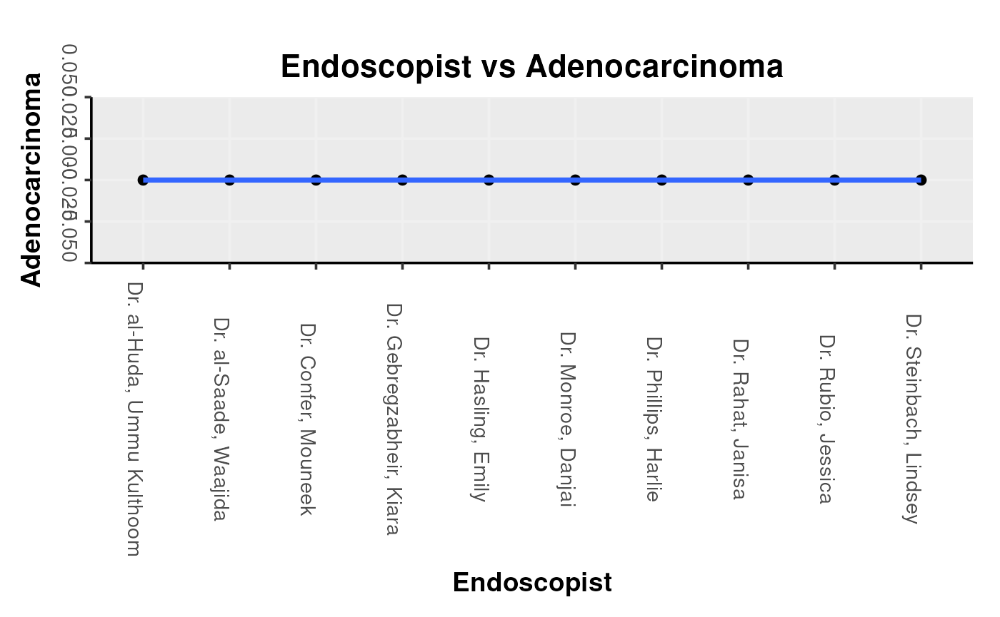

# Polyps

\##**Pathology Detection Quality**

  

\###**Polyp and sample location**

  

A difficult area is the assessment of endoscopic quality by looking at
the pathology processed from an endoscopy. This package is excellent at
dealing with this kind of question because of its ability to merge the
datasets together:

A particularly well developed area to look at is that of the [Global
Rating
Scale](http://www.healthcareimprovementscotland.org/our_work/governance_and_assurance/endoscopy_accreditation/grs_reports.aspx)
for assessing the quality of colonoscopy. One of the metrics- the
adenoma detection rate assesses the number of colonoscopies where at
least one adenoma was detected.

One function is provided to produce a table that gives the number of
adenomas, adenocarcinomas and hyperplastic polyps (also as a ration to
adenomas) by endoscopist therefore immediately fulfilling the GRS
requirement for the ADR as well as providing further metrics alongside.

Having made sure the text is prepared (using the **textPrep** function)
and merged with Pathology reports (which have also been textPrep’d) we
can go straight ahead and use the function **GRS_Type_Assess_By_Unit**
on one of our example datasets called vColon (the format of the dataset
can be seen in the Data vignette. Here we will use the columns
“ProcedurePerformed”,“Endoscopist”, “Diagnosis” and “Histology” to
calculate the adenoma detection rate, as well as the rate of detection
of adenocarcinoma, high grade dysplasia, low grade dysplasia, serrated
adenomas and hyperplastic adenomas.

``` r

  data(vColon)
  nn<-GRS_Type_Assess_By_Unit(
  vColon, "ProcedurePerformed",
  "Endoscopist", "Diagnosis", "Histology")
```

|        Endoscopist         | Adenoma | Adenocarcinoma | HGD | LGD | Serrated |
|:--------------------------:|:-------:|:--------------:|:---:|:---:|:--------:|
|    Dr. Confer, Mouneek     |    0    |       0        |  0  |  0  |    0     |
|  Dr. Gebregzabheir, Kiara  |    0    |       0        |  0  |  0  |    0     |
|     Dr. Hasling, Emily     |    0    |       0        |  0  |  0  |    0     |
|     Dr. Monroe, Danjai     |    0    |       0        |  0  |  0  |    0     |
|    Dr. Phillips, Harlie    |    0    |       0        |  0  |  0  |    0     |
|     Dr. Rahat, Janisa      |    0    |       0        |  0  |  0  |    0     |
|     Dr. Rubio, Jessica     |    0    |       0        |  0  |  0  |    0     |
|   Dr. Steinbach, Lindsey   |    0    |       0        |  0  |  0  |    0     |
| Dr. al-Huda, Ummu Kulthoom |    0    |       0        |  0  |  0  |    0     |
|   Dr. al-Saade, Waajida    |    0    |       0        |  0  |  0  |    0     |

Table continues below {.table style="width:100%;"}

| Hyperplastic |  n  |
|:------------:|:---:|
|      0       | 217 |
|      0       | 190 |
|      0       | 220 |
|      0       | 232 |
|      0       | 235 |
|      0       | 218 |
|      0       | 181 |
|      0       | 191 |
|      0       | 204 |
|      0       | 217 |

  

This of course can then be graphed using the pre-formatted function
**EndoBasicGraph**

``` r

EndoBasicGraph(nn, "Endoscopist", "Adenocarcinoma")
```


